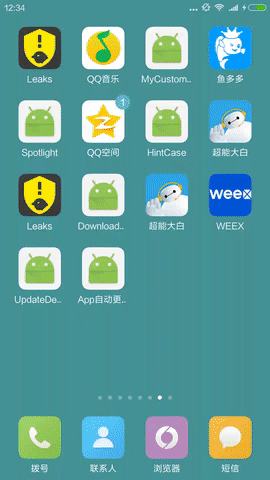

## MyUpdateApk
本项目的存在是因为友盟关闭了自动更新服务，所以自己结合友盟所说的一些自动更新方案，利用Rxjava + Retrofit2 + Okhttp3 + Rxandroid + Service + Fim实现app自动更新

### Introduction
适用于api 14及以上，且加入了Android6.0的权限判断,由于本人很懒就没开发后台apk管理功能，就直接采用fim的公共api实现版本比对

## ScreenShot


## Gradle Config
 first add dependences
```
  dependencies {
    compile 'com.trycatch.android:myupdateapklibrary:1.4.4'
  }
```

## use
首先必须保证你的最新版本versionCode和versionName是随版本升级递增的
```
 versionCode 1
 versionName "1.0"
```
1.自动更新
Activity

```
public class MainActivity extends AppCompatActivity {

    @Override
    protected void onCreate(Bundle savedInstanceState) {
        super.onCreate(savedInstanceState);
        setContentView(R.layout.activity_main);
        UpdateKey.API_TOKEN = "160105e0223dec1896a6648b8265cc95";
        UpdateKey.APP_ID = "57d75987ca87a87c89000b91";
        UpdateKey.WITH_DIALOG=true; //设置是否显示弹出带进度条框
        UpdateKey.WITH_NOTIFITION=true;//设置是否在NOTIFITION上显示进度
        UpdateApk.init(this);
    }

    @Override
    protected void onDestroy() {
        super.onDestroy();
        UpdateApk.destory();
    }
}
```
2.手动更新
```
UpdateApk.setAppUpdateListener(new AppUpdateListener() {
                    @Override
                    public void onStart() {
                        if(dialog!=null&&!dialog.isShowing()){
                            dialog.show();
                        }
                    }

                    @Override
                    public void onCompleted() {
                        Log.d(TAG,"onCompleted()===");
                        if(dialog!=null&&dialog.isShowing()){
                            dialog.dismiss();
                        }
                    }

                    @Override
                    public void onError(Throwable e) {
                        Log.d(TAG,e.toString());
                        if(dialog!=null&&dialog.isShowing()){
                            dialog.dismiss();
                        }
                    }

                    @Override
                    public void onNext(AppInfoModel appInfoModel) {
                        Log.d(TAG,appInfoModel.toString());
                        if(dialog!=null&&dialog.isShowing()){
                            dialog.dismiss();
                        }
                    }

                    @Override
                    public void onNext(AppInfoModel appInfoModel, int state) {
                        Log.d(TAG,appInfoModel.toString());
                        Log.d(TAG,"=state=="+state);
                        switch (state){
                            case UpdateState.BEST_NEW_VSERSION:
                                Toast.makeText(MainActivity.this,"this is best new version",Toast.LENGTH_SHORT).show();
                                break;
                            case UpdateState.BEST_HEIGHT_VERSION:
                                Toast.makeText(MainActivity.this,"this is highest version",Toast.LENGTH_SHORT).show();
                                break;
                            case UpdateState.NEED_UPDATE_VERSION:
                                Toast.makeText(MainActivity.this,"need update new version",Toast.LENGTH_SHORT).show();
                                break;
                            default:
                                
                        }
                        if(dialog!=null&&dialog.isShowing()){
                            dialog.dismiss();
                        }
                    }
                });
                UpdateApk.init(MainActivity.this);
```

AndroidManifest.xml
```
<service android:name="com.trycath.myupdateapklibrary.service.DownloadFileService" />
<!-- 如果你的app支持android7.0及以上，那么在android apk的时候临时给app授权访问文件的权限-->
<provider
    android:name="android.support.v4.content.FileProvider"
    android:authorities="${applicationId}.provider.download"
    android:exported="false"
    android:grantUriPermissions="true">

    <meta-data
        android:name="android.support.FILE_PROVIDER_PATHS"
        android:resource="@xml/file_paths"/>

</provider>

```
## License

```
Copyright 2016 trycatch

Licensed under the Apache License, Version 2.0 (the "License");
you may not use this file except in compliance with the License.
You may obtain a copy of the License at

   http://www.apache.org/licenses/LICENSE-2.0

Unless required by applicable law or agreed to in writing, software
distributed under the License is distributed on an "AS IS" BASIS,
WITHOUT WARRANTIES OR CONDITIONS OF ANY KIND, either express or implied.
See the License for the specific language governing permissions and
limitations under the License.
```